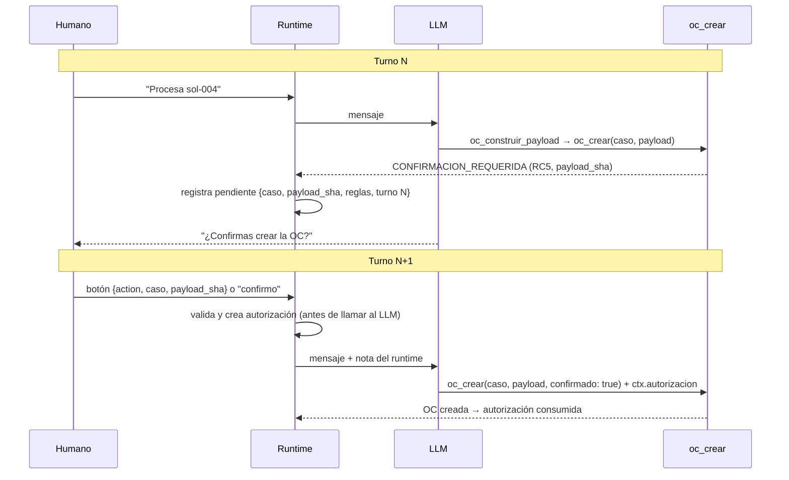

# SOLUCION — Agente de Órdenes de Compra

Reto 03 · Automatización de compras con IA

Documento técnico de decisión. Para instalar y ejecutar, ver [README.md](README.md). Los requerimientos están en [PRD.md](PRD.md); la estructura sigue la sección 9.1 del PRD, con secciones adicionales sobre integridad, idempotencia y seguridad.

## Contenido

1. [Problema](#1-problema)
2. [Principios arquitectónicos](#2-principios-arquitectónicos)
3. [Arquitectura](#3-arquitectura)
4. [Ciclo del agente](#4-ciclo-del-agente)
5. [Elección del modelo y costo](#5-elección-del-modelo-y-costo)
6. [Matriz de controles RC1–RC10](#6-matriz-de-controles-rc1rc10)
7. [Confirmación humana (human-in-the-loop)](#7-confirmación-humana-human-in-the-loop)
8. [Integridad y sellado](#8-integridad-y-sellado)
9. [Idempotencia y fallos parciales](#9-idempotencia-y-fallos-parciales)
10. [Trazabilidad y auditoría](#10-trazabilidad-y-auditoría)
11. [Diseño del adaptador SAP real](#11-diseño-del-adaptador-sap-real)
12. [Lectura del proceso: órdenes retroactivas](#12-lectura-del-proceso-órdenes-retroactivas)
13. [Seguridad y guardrails](#13-seguridad-y-guardrails)
14. [Decisiones y trade-offs](#14-decisiones-y-trade-offs)
15. [Supuestos](#15-supuestos)
16. [Cobertura y pruebas](#16-cobertura-y-pruebas)
17. [Uso de IA](#17-uso-de-ia)
18. [Riesgos, limitaciones y evolución a producción](#18-riesgos-limitaciones-y-evolución-a-producción)
19. [Deployment de demostración](#19-deployment-de-demostración)

---

## 1. Problema

**La analista de compras digita a mano en SAP cada orden de compra a partir de un correo con tres o cuatro piezas, verificando de memoria proveedor, aprobador, topes, IVA y condiciones de pago.** Le duele a administración (tiempo y errores de digitación), a auditoría (evidencia adjunta manualmente, controles no demostrables) y a la dirección (nadie mide cuántas compras se hacen antes de solicitarse: las OC retroactivas).

El agente lee el paquete, aplica los controles de forma determinista, construye la OC con trazabilidad por campo, pide confirmación humana cuando una regla lo exige y crea la OC en un SAP simulado. Las excepciones no se fuerzan: se clasifican y vuelven al humano con una acción sugerida.

## 2. Principios arquitectónicos

| # | Principio | Cómo se materializa |
|---|---|---|
| 1 | **El LLM interpreta y orquesta.** | Decide qué tool llamar y explica resultados en lenguaje natural. No produce ningún valor que llegue a SAP. |
| 2 | **El dominio determinista decide las reglas.** | RC1–RC10 son funciones puras en `src/domain/controles.ts`: sin E/S, sin reloj, sin LLM. Mismo paquete → mismo resultado. |
| 3 | **Las tools ejecutan acciones.** | Cinco tools `oc_*` con las firmas del PRD 6.2, validadas por zod. Los objetos que reenvía el modelo (`paquete`, `derivados`, `payload`) se contrastan con el estado canónico y nunca son fuente de valores. |
| 4 | **El runtime autoriza.** | La confirmación humana la interpreta `src/agent/autorizacion.ts` antes de llamar al modelo y se entrega a `oc_crear` por `ctx.autorizacion`, fuera del alcance del LLM. |
| 5 | **El payload sellado es inmutable.** | `payload.json` se escribe una vez con su SHA-256; cualquier diferencia posterior es un conflicto, no una sobrescritura. |
| 6 | **SAP es idempotente por `solicitud_id`.** | Antes de crear se busca la OC por referencia; si existe, se devuelve la misma. |
| 7 | **Toda acción deja trazabilidad.** | `log.jsonl` por llamada a tool, `control.csv` por intento de creación, `trazabilidad.json` por campo, `ejecucion.json` por OC. |

## 3. Arquitectura

```mermaid
flowchart TD
    U[Usuario / UI web] -->|POST /api/chat| API[API HTTP<br/>src/server.ts]
    U -->|POST /api/confirm<br/>botón Confirmar| API
    API --> RT[Runtime de sesión<br/>un turno a la vez por sesión]
    RT --> AUTH[Runtime de autorización<br/>src/agent/autorizacion.ts]
    RT --> LOOP[Agent loop<br/>src/agent/loop.ts]
    LOOP <--> LLM[LlmAdapter<br/>Anthropic]
    LOOP --> TOOLS[Tools oc_*<br/>validación zod]
    AUTH -. ctx.autorizacion .-> TOOLS
    TOOLS --> DOM[Dominio determinista<br/>RC1–RC10 · evidencia · payload sellado]
    TOOLS --> SAP[SapAdapter]
    SAP --> MOCK[MockSapAdapter<br/>out/sap/ordenes.jsonl]
    TOOLS --> PER[Persistencia out/<br/>control.csv · log.jsonl · artefactos por caso]

    classDef llm fill:#fde68a,stroke:#b45309,color:#111
    classDef det fill:#bbf7d0,stroke:#15803d,color:#111
    class LLM llm
    class DOM,AUTH det
```

**Dónde vive cada cosa** (separación evaluada por el PRD 6.5):

| Pieza | Ubicación | Cambia cuando… |
|---|---|---|
| Comportamiento (system prompt, guardrails) | `agent/prompt.md` | cambia cómo debe conversar el agente |
| Conocimiento del proceso | `src/knowledge/ordenes-compra.md` | cambia la explicación del proceso para el modelo |
| Reglas de negocio | `src/domain/controles.ts`, `src/domain/payload.ts` | cambia una regla RC o el mapeo del payload |
| Ejecución | `src/tools/oc.ts` + `src/tools/runner.ts` | cambia una acción o su contrato |
| Integración SAP | `src/sap/adapter.ts` (interfaz), `src/sap/mock.ts` | se conecta un SAP real |
| Transporte | `src/server.ts`, `web/` | cambia la API o la UI |

Un cambio de reglas de negocio no toca el servidor ni el loop. El system prompt es `prompt.md` + `ordenes-compra.md` concatenados al arrancar.

**Flujo de datos**: `fixtures/` → ingestión y normalización (`src/ingestion/`) → `Paquete` canónico → controles → evidencia (`aprobacion.txt` + sha256) → payload `OrdenCompra` sellado → autorización (si aplica) → `SapAdapter.crearOrden` → `out/`.

**Contrato de tools.** Las firmas públicas siguen el contrato del PRD 6.2. Todas devuelven `{ ok: true, data }` o `{ ok: false, error: { codigo, mensaje, sugerencia, detalle? } }`, nunca lanzan excepciones al loop, y rechazan argumentos no documentados (`ARGS_INVALIDOS`).

| Tool | Entrada (PRD 6.2) | Efecto |
|---|---|---|
| `oc_leer_paquete` | `{ caso }` | Lee y normaliza; un adjunto ausente es `null` con su nombre en `faltantes`. |
| `oc_validar` | `{ caso, paquete }` | Aplica RC1–RC10; devuelve `apta`, bloqueos, confirmaciones, derivados, `retroactiva`. Sin escritura. |
| `oc_generar_evidencia` | `{ caso }` | Escribe `aprobacion.txt` con su sha256 (solo si el caso no está bloqueado). |
| `oc_construir_payload` | `{ caso, paquete, derivados }` | Construye, valida y sella `payload.json` + `trazabilidad.json`. |
| `oc_crear` | `{ caso, payload, confirmado? }` | Única tool con efecto en SAP. Escribe `ejecucion.json` y una fila en `control.csv`. `payload: null` solo registra el intento de un caso bloqueado. |

**Compatible con el contrato por fuera; datos reconstruidos y verificados por dentro.** Los objetos enviados por el agente se consideran no confiables y se contrastan contra el estado canónico antes de ejecutar:

- **`paquete`** (`oc_validar`, `oc_construir_payload`): la tool relee el caso desde `fixtures/` y compara el paquete recibido con el que devolvió `oc_leer_paquete` (JSON canónico). Si difieren → `ARGS_INVALIDOS` con `motivo: paquete_no_coincide` y solo las rutas de los campos distintos, nunca sus valores. Los controles se evalúan siempre sobre el paquete canónico.
- **`derivados`** (`oc_construir_payload`): se comparan con los que calculan RC6/RC7 en ese momento. Cualquier diferencia → `derivados_no_coinciden`. Por ejemplo, si el modelo envía `C9` y el dominio deriva `C1`, se rechaza; el argumento nunca se "prefiere".
- **`payload`** (`oc_crear`): se compara por hash canónico con el payload sellado en `out/` (`PAYLOAD_NO_COINCIDE`, `motivo: payload_distinto`). No se persiste ni se envía a SAP: a SAP va siempre el payload sellado.
- **`confirmado`** (`oc_crear`): es una declaración, no un permiso. Si el caso requiere confirmación y no hay `ctx.autorizacion` válida → `CONFIRMACION_REQUERIDA` o `AUTORIZACION_INVALIDA`, aunque llegue `confirmado: true`. Si hay autorización válida pero la llamada no declara `confirmado: true` → `ARGS_INVALIDOS` (`confirmado_inconsistente`) y no se ejecuta. En un caso sin confirmaciones no se exige.

### Decisiones de implementación respecto a la referencia del PRD

**A. `/api/confirm`.** Materializa el evento explícito del botón de confirmación y lo entrega exactamente al mismo runtime de confirmación que un mensaje "confirmo".

**B. `/api/health` minimizado.** Expone solo lo necesario para un diagnóstico seguro (`ok`, `servicio`, `version`, `llmConfigured`), sin proveedor ni modelo. La sección 6.4 del PRD es una referencia de diseño libre.

**C. Forma de la respuesta de la API.** `{ ok, data: { respuesta, estado, eventos[], needsConfirmation, pendingConfirmation, autorizacion } }` se adapta a la UI: tarjetas por llamada a tool y banner de confirmación. Cada evento muestra el nombre de la tool, sus argumentos en una proyección segura y fiel, y el resultado resumido (PRD 6.1). En la proyección, `caso` y `confirmado` van tal cual; el `paquete` se resume en `solicitud_id`, NIT, valor y moneda; los `derivados` se muestran por sus códigos y el `payload` por su `payload_sha`. Mantiene estados estructurados y no expone textos de documentos, payloads completos ni respuestas crudas del proveedor.

**D. Parámetro `sistema` en `LlmAdapter`.** El PRD 6.1 describe la interfaz como `enviar(mensajes, herramientas) → respuesta`; la implementada es `enviar(mensajes, herramientas, sistema)`. El system prompt forma parte de la abstracción del proveedor (cada API lo transporta de forma distinta). Cambiar de proveedor sigue sin tocar el ciclo del agente.

**E. `payload: null` en `oc_crear`.** El campo `payload` es obligatorio. `null` declara explícitamente que no existe payload porque el caso está bloqueado: permite registrar el intento en `control.csv` (HU-5) y nunca puede producir una creación en SAP. En un caso apto, `null` es `ARGS_INVALIDOS`.

**F. Salida de `oc_construir_payload`.** La `OrdenCompra` (7.4) se devuelve bajo la clave `payload`, junto con `payload_sha`, `ruta_trazabilidad` y metadatos (`requiere_confirmacion`, `confirmaciones`, `ruta_payload`, `resumen`). Contiene todo lo que pide el contrato, por lo que se considera materialmente compatible.

**G. Contexto de las tools.** `ctx` es un superconjunto del contexto mínimo del PRD (`directory`, `sessionId`): añade `turnoId`, `reloj` y, solo cuando el runtime la otorga, `autorizacion`.

**H. `confirmado: false` con autorización válida.** Falla cerrado: no se crea la OC y el usuario debe confirmar de nuevo (sección 7).

**I. Retransmisión por el LLM real.** El modelo debe retransmitir `paquete`, `derivados` y `payload` sin alterarlos. Cualquier discrepancia se rechaza y nunca produce una OC con datos manipulados.

## 4. Ciclo del agente

Implementado a mano en `src/agent/loop.ts` sobre una interfaz `LlmAdapter` propia (provider-neutral), sin frameworks de agentes:

1. **Antes de llamar al modelo**, el runtime de autorización resuelve el mensaje: ¿confirma, rechaza o es otra cosa respecto del pendiente del turno anterior? (sección 7).
2. Se envía al modelo el historial, el system prompt y las definiciones de tools (JSON Schema generado desde los esquemas zod).
3. Si el modelo pide tools, se ejecutan a través del runner (validación de argumentos, log, errores tipados); todos los resultados vuelven en un único mensaje.
4. Se repite hasta que el modelo responde texto o se alcanza un límite.

| Regla PRD | Implementación |
|---|---|
| CA1 tope de iteraciones | `MAX_ITERACIONES` (25 por defecto). Al alcanzarlo se responde con un mensaje explícito y el historial queda válido. |
| Presupuesto de costo | `MAX_TOKENS_SESION` (200.000). Se verifica antes de cada llamada; al agotarse no se vuelve a llamar al modelo. |
| CA2 no afirmar valores sin tool | Prohibido en el prompt; además, los valores operativos no pasan por el modelo. |
| CA3 confirmación humana | Resuelta por el runtime, no por el modelo (sección 7). |
| CA4 llamadas visibles | Cada llamada queda en `out/log.jsonl` y como tarjeta en el chat. |
| CA5 errores sin matar la sesión | Errores de tool vuelven al modelo como resultado estructurado; errores del proveedor (timeout, red, límites) se traducen a mensajes saneados y la sesión continúa. |

El historial es append-only y siempre válido: toda llamada a tool recibe su resultado, incluso si la respuesta del modelo se cortó.

## 5. Elección del modelo y costo

- **Proveedor y modelo**: Anthropic, `claude-opus-5-5`, `effort: medium`, `max_tokens` 16.000, timeout 60 s, 1 reintento del SDK, sin streaming. Configurable por variables de entorno.
- **Por qué**: el valor del agente está en orquestar tools de forma fiable, seguir guardrails y explicar resultados con precisión en español; un modelo de primera línea reduce errores de orquestación en un flujo de 5 tools. El riesgo de negocio no depende del modelo: reglas, montos y autorización están fuera de él, por lo que cambiar a un modelo más económico es una decisión de costo/experiencia, no de control.
- **Proveedor intercambiable**: el loop solo conoce `LlmAdapter` (`enviar(mensajes, herramientas, sistema)`); añadir otro proveedor es una clase nueva.

**Costo por caso (estimación de diseño, no benchmark).** El adaptador Anthropic se probó en la demo pública con llamadas reales a `claude-opus-5-5` (smoke test de sol-001 y sol-004, sección 19). Eso valida la integración, no el costo: no se hizo un benchmark financiero exhaustivo y no se reporta costo monetario por caso.

- **Qué se verificó:** el `AnthropicAdapter` funciona contra la API real en el deployment. En los tests (sin red ni clave) se prueban su traducción de errores y su diagnóstico saneado contra un servidor falso local. El loop solo depende de la interfaz `LlmAdapter`, y sus tests usan adaptadores guionados (`LlmGuionado`) y por reglas (`LlmReglas`).
- **Tamaño del contexto:** como referencia de diseño, el flujo acumula del orden de decenas de miles de tokens de entrada por caso. Cada una de las ~6 llamadas al modelo de un caso completo reenvía el prefijo fijo y el historial con los resultados de tools.
  - Prefijo fijo: ~9.000 caracteres de system prompt más ~2.200 de definiciones de tools.
  - Resultados de tools de un caso completo: ~6.000–7.000 caracteres (sol-001 y sol-004, ejecutando las tools localmente).
- **Orden de magnitud:** para planificación se estimaron ~20–30k tokens de entrada y ~1–4k de salida en un flujo completo. Se mantiene como referencia: el smoke test real no midió consumo por caso.
- **Costo efectivo:** dependerá del modelo y su precio vigente, y del patrón real de conversación (turnos, reintentos, longitud de las respuestas). Se aproxima con `tokens_entrada × precio_entrada + tokens_salida × precio_salida`.
- **Palancas:** como el prefijo fijo se repite en cada llamada, **prompt caching** es la primera palanca de reducción (evolución, no implementada). `MAX_TOKENS_SESION` acota el gasto por sesión.

## 6. Matriz de controles RC1–RC10

Estados posibles por control: `CUMPLE`, `BLOQUEO`, `CONFIRMACION`, `DERIVADO`, `NO_EVALUABLE` (con `depende_de` una regla bloqueada), `NO_APLICA`. Cada resultado incluye los valores comparados, un `motivo` y una `accion_sugerida` en forma de código; la redacción en lenguaje natural la hace el agente.

| RC | Control | Tipo | Acción | Evidencia / fuente |
|---|---|---|---|---|
| RC1 | Proveedor existe (por NIT; sin NIT, por nombre normalizado exacto) y está activo | Bloqueo | Bloquea si no existe, es ambiguo o está inactivo | `maestros/proveedores.json` |
| RC2 | Aprobación existe, contiene "Aprobado" y la firma un aprobador del centro de costo | Bloqueo | Bloquea | `aprobacion.json` + `maestros/centros-costo.json` |
| RC3 | `valor_total` ≤ tope del aprobador en ese centro | Bloqueo / No evaluable | Bloquea si excede; `NO_EVALUABLE` (depende de RC2) si el firmante no es aprobador del centro | `centros-costo.json` (topes) |
| RC4 | Subárea pertenece al centro de costo | Bloqueo | Bloquea | `centros-costo.json` |
| RC5 | Diferencia absoluta cotización vs solicitud ≤ 2 % de la solicitud (aritmética entera) | Confirmación | Confirmación si excede 2 % o si no hay cotización; la OC usa el valor de la **solicitud** | `cotizacion.txt` vs `solicitud.json` |
| RC6 | Indicador de IVA ausente | Derivado + confirmación | Deriva `indicador_iva_default` del proveedor y pide confirmación | `proveedores.json` |
| RC7 | Condiciones de pago ausentes | Derivado (informativo) | Deriva `condiciones_pago_default` del proveedor; solo se informa | `proveedores.json` |
| RC8 | Factura con fecha anterior a `fecha_solicitud` | Confirmación | Marca `retroactiva = true` y pide confirmación; se registra en `control.csv` | `factura.txt` |
| RC9 | Fecha de aprobación ≥ `fecha_solicitud` | Confirmación | Confirmación si la aprobación es anterior; `NO_EVALUABLE` si no hay aprobación | `aprobacion.json` |
| RC10 | `cantidad × valor_unitario = valor_total` (± 1) | Bloqueo | Bloquea | `solicitud.json` |

Resultado sobre los fixtures (verificado en `tests/controles.test.ts`):

| Caso | Resultado |
|---|---|
| sol-001 | Todo `CUMPLE` (RC8 `NO_APLICA`) |
| sol-002 | RC1 `BLOQUEO` (NIT inexistente) |
| sol-003 | RC2 `BLOQUEO`; RC3 `NO_EVALUABLE` (depende de RC2) |
| sol-004 | RC5 `CONFIRMACION` (diferencia exacta de 6 %) |
| sol-005 | RC8 `CONFIRMACION` (retroactiva) |
| sol-006 | RC6 `CONFIRMACION` (IVA `C1` derivado); RC7 `DERIVADO` (pago `Z030`) |

Además de RC1–RC10, el payload valida integridad con los catálogos (`indicadores-iva.json`, `condiciones-pago.json`); un código inexistente es `CATALOGO_INVALIDO`, no una regla de negocio nueva.

**La más difícil: RC3.** El PRD define el tope "del aprobador para ese centro", pero en `sol-003` quien firma no es aprobador del centro: no existe tope que aplicar. Usar el tope máximo del centro habría inventado una regla, y marcar `BLOQUEO` habría duplicado el motivo de RC2. La solución fue el estado `NO_EVALUABLE` con `depende_de: "RC2"` y una invariante comprobada en código (todo `NO_EVALUABLE` apunta a una regla en `BLOQUEO`; un estado imposible es un error de programación, no un resultado). El mismo patrón resolvió RC6/RC7 cuando RC1 no resuelve el proveedor y RC9 sin aprobación. RC5 tuvo la segunda dificultad: la comparación se hace en enteros (`diferencia × 100 ≤ 2 × solicitud`) para que el borde exacto del 2 % no dependa de redondeo en coma flotante.

## 7. Confirmación humana (human-in-the-loop)

**El LLM nunca fabrica la autorización.** El modelo puede pedir confirmación y puede llamar a `oc_crear`, pero la autorización solo existe si el runtime la creó a partir de una acción del usuario.



**Turno N.** Cuando `oc_construir_payload` devuelve `requiere_confirmacion` o `oc_crear` devuelve `CONFIRMACION_REQUERIDA`, el runtime registra **un** pendiente por sesión: caso, `payload_sha`, reglas y número de turno. `needsConfirmation` y `pendingConfirmation` en la API salen de ese estado, nunca del texto del modelo.

**Turno N+1 (solo ese).** El runtime clasifica la entrada antes de llamar al modelo:

- **Botón** `{ action: "confirm", caso, payload_sha }`: debe coincidir exactamente con el pendiente vigente de esa sesión.
- **Mensaje**: lista cerrada (`confirmo`, `sí, confirmo`, `confirmar`, `proceda`, `procede`, `adelante`), normalizada en mayúsculas, tildes y puntuación. La negación tiene prioridad (`no confirmo` cancela). Las preguntas nunca confirman (`¿confirmo?`). Cualquier otro mensaje cancela el pendiente y la conversación sigue.
- Texto del usuario que imite la nota del runtime (`[Runtime] …`) se neutraliza antes de llegar al modelo y no produce autorización.

**Verificación en `oc_crear`.** La autorización llega por `ctx.autorizacion`. El modelo no puede pasarla como argumento: el esquema es estricto y rechaza campos no documentados. `oc_crear` exige que coincidan `accion = crear_oc`, `caso`, `payload_sha`, `session_id`, `turno_id` y `consumida = false`; si no, `AUTORIZACION_INVALIDA`.

El argumento `confirmado` del contrato PRD nunca construye ni sustituye esa autorización. `confirmado: true` sin autorización → `CONFIRMACION_REQUERIDA`, sin OC. Autorización válida sin `confirmado: true` → `ARGS_INVALIDOS` (`confirmado_inconsistente`), sin OC. Por la política de consumo, ese rechazo consume la autorización, así que el usuario debe confirmar de nuevo: el sistema falla cerrado.

**Consumo.** Éxito (o respuesta idempotente) → consumida. `SAP_ERROR` o `ERROR_ESCRITURA` → se conserva **solo dentro del mismo turno** para un reintento seguro (la creación es idempotente). Cualquier otro error → consumida. Al terminar el turno, toda autorización se descarta. Otra sesión no puede usar el pendiente ajeno ni por mensaje ni por botón.

Nota de registro: `ejecucion.json` guarda la autorización tal como se presentó a `oc_crear` (`consumida: false`); el consumo posterior lo marca el runtime en memoria.

## 8. Integridad y sellado

Objetivo: **lo que se revisó y confirmó es exactamente lo que se ejecuta en SAP.**

- **JSON canónico** (`src/domain/sello.ts`): claves ordenadas por código de unidad, sin espacios, `NaN`/`Infinity` rechazados. Las cadenas se hashean tal cual (sin normalización Unicode implícita).
- **SHA-256** del payload canónico → `payload_sha`. El payload no contiene timestamps, por lo que es reproducible.
- **Evidencia sellada**: `aprobacion.txt` (encabezados, cuerpo y sha256). Su hash se incluye en el payload (`aprobador.evidencia_sha256`), de modo que cambiar la evidencia cambia el `payload_sha`. Antes de construir se verifica que el archivo coincida con la aprobación actual (`EVIDENCIA_INCONSISTENTE` / `FALTA_EVIDENCIA`).
- **Payload write-once**: si ya existe un `payload.json` distinto, `PAYLOAD_NO_COINCIDE`; nunca se sobrescribe. La trazabilidad está ligada al mismo `payload_sha`.
- **Fuentes permitidas del payload**: solicitud, maestros, aprobación, derivados RC6/RC7 y constantes del PRD. Nunca la cotización como monto ni valores del modelo.
- **Revalidación antes de SAP** (`oc_crear`): se reevalúan los controles, se recalcula el hash del payload almacenado, se compara con el hash del `payload` recibido y con las confirmaciones vigentes, y se revalidan los catálogos.
- **Argumentos del modelo no confiables**: `paquete` y `derivados` deben coincidir con el estado canónico y `payload` con el sellado. Ninguno se persiste ni se usa como valor (sección 3).
- **Detección de manipulación** (probada): payload editado con hash viejo, hash declarado incorrecto, evidencia alterada o borrada, trazabilidad de otro payload y catálogo modificado entre construir y crear. En todos los casos no se crea la OC.

## 9. Idempotencia y fallos parciales

**Clave de idempotencia: `solicitud_id`.** `oc_crear` siempre consulta primero `buscarOrdenPorReferencia(solicitud_id)`:

- si la OC existe, devuelve la misma (`idempotente: true`) y no llama a `crearOrden`;
- el mock repite la verificación dentro de su candado, por lo que dos creaciones concurrentes producen una sola OC.

**Fallo parcial.** El caso delicado es: SAP crea la OC, pero falla la escritura local (`ejecucion.json` o `control.csv`).

```
SAP crea la OC ──► falla la persistencia ──► ERROR_ESCRITURA (autorización conservada en el turno)
      ▲                                                │
      └──── reintento: buscarOrdenPorReferencia ◄──────┘
            → OC existente → se reconstruye ejecucion.json → misma OC, sin duplicado
```

Si el registro local falta pero la OC existe, la respuesta se reconstruye desde el payload sellado. Si SAP no responde, `SAP_ERROR` y el reintento es seguro por la misma razón.

**Hallazgo del proceso de pruebas.** Durante el hardening (F11) se detectó que errores de sistema de archivos posteriores a una creación en SAP podían clasificarse como error interno en lugar de `ERROR_ESCRITURA`, lo que impedía el reintento autorizado dentro del turno. Se corrigió normalizando todos los errores de persistencia como `ErrorPersistencia`; los tests de fallo parcial verifican el reintento idempotente.

## 10. Trazabilidad y auditoría

| Artefacto | Granularidad | Contenido |
|---|---|---|
| `out/log.jsonl` | Llamada a tool | `ts, sesion, herramienta, caso, ok, codigo_error, resumen, duracion_ms` (sin argumentos completos ni textos de correo) |
| `out/control.csv` | Intento de creación | `solicitud_id, resultado, numero_oc, retroactiva, bloqueos, confirmaciones, ts` (exitoso, bloqueado o pendiente) |
| `out/<caso>/trazabilidad.json` | Campo del payload | Ruta del campo, valor, fuente (`solicitud`, `cotizacion`, `maestro.<x>`, `derivado`) y detalle; resultados de RC1–RC10 |
| `out/<caso>/ejecucion.json` | OC creada | Número, fecha, `payload_sha`, idempotencia y autorización usada |
| `out/sap/ordenes.jsonl` | OC en SAP simulado | Número, fecha y orden completa |

El CSV escapa comas y comillas y rechaza saltos de línea (evita inyección de filas). JSONL y CSV se escriben con líneas completas bajo candado; los archivos completos, con escritura atómica (temporal + fsync + rename).

## 11. Diseño del adaptador SAP real

El dominio, las tools y el loop dependen solo de la interfaz `SapAdapter`:

```ts
interface SapAdapter {
  consultarProveedor(nit: string): Promise<{ codigo_sap: string; activo: boolean } | null>
  crearOrden(orden: OrdenCompra): Promise<{ numero_oc: string; fecha: string }>
  buscarOrdenPorReferencia(solicitud_id: string): Promise<{ numero_oc: string } | null>
}
```

`MockSapAdapter` → `SapS4Adapter` (o `SapIntegrationSuiteAdapter`) se sustituye en la fábrica de dependencias de `src/tools/oc.ts`, **sin cambiar dominio, tools ni agent loop**.

### Opciones

| Opción | Cuándo usar | Ventajas | Consideraciones |
|---|---|---|---|
| **OData S/4HANA** (`API_PURCHASEORDER_PROCESS_SRV`) | S/4HANA con API habilitada en Communication Arrangement | API estándar publicada, HTTP/JSON, buen encaje con TypeScript | Requiere scope de comunicación, usuario técnico y CSRF token; manejo de errores por mensaje SAP |
| **BAPI/RFC** (`BAPI_PO_CREATE1`) vía capa de integración | ECC o S/4 sin OData habilitado | Funcionalidad completa y conocida por el equipo SAP | RFC no se consume directo desde Node; requiere middleware (SAP Cloud Connector, Integration Suite o servicio Java/.NET con JCo/NCo); `BAPI_TRANSACTION_COMMIT` explícito |
| **SAP Integration Suite** (iFlow) | Organización con integración centralizada | Gobierno, monitoreo, reintentos y mapeo fuera del agente; oculta OData vs RFC | Dependencia de otro equipo y licencias; latencia adicional |
| **Archivo / batch** (plan B) | Conexión no viable en el corto plazo | Sin integración en línea; aprovecha cargas masivas existentes | No es tiempo real; requiere reconciliación posterior |

**Recomendación** (sujeta al landscape real, que no está confirmado): si existe S/4HANA, **OData `API_PURCHASEORDER_PROCESS_SRV`** expuesto a través de Integration Suite o API Management cuando la organización ya los use; si es ECC, **`BAPI_PO_CREATE1`** detrás de una capa de integración. El agente nunca habla RFC directamente.

### Mapeo del payload (orientativo para OData)

| `OrdenCompra` | Purchase Order |
|---|---|
| `sociedad` | `CompanyCode` |
| `organizacion_compras` | `PurchasingOrganization` (+ `PurchasingGroup` por configuración) |
| `proveedor.codigo_sap` | `Supplier` |
| `moneda` | `DocumentCurrency` |
| `condiciones_pago` | `PaymentTerms` |
| `referencia.solicitud_id` | Campo de referencia acordado (p. ej. `YourReference` o campo de usuario) — **clave de idempotencia** |
| `posiciones[].numero` | `PurchaseOrderItem` |
| `posiciones[].descripcion` (≤ 40) | `PurchaseOrderItemText` |
| `posiciones[].cantidad` / `unidad` | `OrderQuantity` / `PurchaseOrderQuantityUnit` |
| `posiciones[].precio_unitario` | `NetPriceAmount` |
| `posiciones[].indicador_iva` | `TaxCode` |
| `posiciones[].centro_costo` | Imputación: `AccountAssignmentCategory = K` + `CostCenter` |
| `aprobador.evidencia_sha256` + `aprobacion.txt` | Nota de cabecera o adjunto (GOS / Attachment Service) |

`buscarOrdenPorReferencia` se implementa como consulta por el campo de referencia elegido; `consultarProveedor`, sobre el maestro de proveedores (`A_Supplier` o BAPI equivalente).

### Autenticación y credenciales

Usuario técnico con permisos mínimos (crear y leer pedidos, leer proveedores) mediante OAuth 2.0 client credentials o certificado X.509. Credenciales en un gestor de secretos y solo en el adaptador del backend: **nunca en el agente, el prompt, el frontend ni los logs**. El LLM no conoce la existencia de credenciales SAP.

### Errores, idempotencia y error parcial

- Antes de crear: búsqueda por referencia (ya implementado en `oc_crear`).
- Timeout o error ambiguo tras enviar: **no** se asume fallo; el reintento empieza por la búsqueda por referencia (mismo flujo de la sección 9).
- Errores de negocio de SAP (proveedor bloqueado, período cerrado, presupuesto): se traducen a errores tipados con mensaje claro y no se reintentan automáticamente.
- Errores técnicos (5xx, red): reintento con backoff limitado.

### Plan B (si SAP no está disponible o la conexión no es viable)

- **No fingir éxito**: sin número de OC real no se informa "OC creada".
- La solicitud queda en estado recuperable con su payload sellado; el reintento es idempotente por `solicitud_id`.
- Para operación productiva se recomienda una **cola/outbox transaccional**: el agente registra la intención de creación y un worker la entrega a SAP con reintentos (no implementado).
- **Reconciliación** periódica por `solicitud_id` entre `control.csv`/outbox y SAP.
- Si la integración en línea no es viable, el agente sigue ahorrando el trabajo de validación y armado: el payload sellado y validado puede exportarse como plantilla de carga masiva o como OC "lista para pegar", con la evidencia y la trazabilidad ya generadas (diseño, no implementado).

## 12. Lectura del proceso: órdenes retroactivas

**Definición.** Una OC es retroactiva cuando existe factura con `fecha_factura < fecha_solicitud`: el gasto ocurrió antes de que se solicitara la compra. El agente no la rechaza (la política no está definida en el PRD); la marca, exige confirmación y la registra en `control.csv` (`retroactiva = true`).

**Métrica.**

```
% OC retroactivas = OC retroactivas creadas / OC totales creadas × 100
```

Calculable directamente desde `control.csv` (filas `resultado = exitoso`). Conviene segmentarla por **centro de costo, subárea, proveedor, solicitante, mes y rango de monto**.

**Qué le diría a la dirección.** El indicador no mide un error de digitación: mide cuántas compras se hacen fuera del proceso. Un porcentaje sostenido o concentrado puede revelar:

- **compras fuera de proceso** (se compra primero y se regulariza después);
- **cuellos de botella** en la aprobación, que empujan a comprar sin esperar;
- **regularización tardía** de servicios recurrentes que deberían tener contrato o pedido marco;
- **problemas de adopción** del procedimiento en áreas concretas;
- **riesgo de control**: el gasto se compromete sin validación previa de presupuesto ni aprobador.

**Cambio de proceso que propondría.** Primero medir sin castigar (línea base por área durante unos meses). Después, según dónde se concentre: pedidos marco para proveedores recurrentes, tiempos de aprobación con seguimiento, y una política explícita de la dirección sobre si las retroactivas se toleran con justificación o se escalan. No propongo metas numéricas sin una línea base real.

## 13. Seguridad y guardrails

| Riesgo | Control |
|---|---|
| Prompt injection en correos, cotizaciones o aprobaciones | El prompt los declara DATO; ninguna tool acepta instrucciones ni valores de negocio desde el modelo, así que un texto inyectado no puede cambiar montos, proveedor ni autorización. |
| El modelo "arregla" un monto | Los montos salen de la solicitud y los maestros; el payload está sellado y se revalida antes de SAP. |
| Autoconfirmación del modelo | La autorización vive en el runtime y llega por `ctx`. `confirmado: true` es una declaración sin efecto si no hay autorización. Argumentos no documentados (p. ej. `autorizacion`) se rechazan con `ARGS_INVALIDOS`. |
| Datos de negocio alterados por el modelo | `paquete`, `derivados` y `payload` recibidos se comparan con el estado canónico (JSON canónico / hash) y se rechazan si difieren; las tools solo usan los valores canónicos. |
| Suplantación de la nota del runtime | El texto `[Runtime]` del usuario se neutraliza; la autorización nunca se deriva de texto que llega al modelo. |
| Entradas maliciosas en tools | `caso` validado por patrón; rutas confinadas a `fixtures/` y `out/`; sin comandos de shell. |
| Entradas maliciosas en HTTP | Esquemas zod estrictos, límite de cuerpo (16 KB) y de mensaje (2000), 400/405/413/415 controlados. |
| Path traversal en estáticos | Lista blanca de 4 archivos de `web/`; ninguna ruta del cliente toca el disco. |
| Fuga de secretos | Clave solo en variables de entorno del backend; `/api/health` no expone proveedor, modelo, rutas ni entorno. |
| Fuga de detalles internos | Errores saneados sin stack traces ni rutas absolutas; logs sin argumentos completos ni textos de correo. |
| XSS en la UI | CSP `default-src 'self'`, `X-Content-Type-Options: nosniff`, renderizado con `textContent`. |
| Mezcla de sesiones | Estado por sesión, un turno a la vez por sesión, pendientes no transferibles entre sesiones. |

**`sessionId` no es autenticación**: aísla sesiones de navegador, pero cualquiera que conozca un `sessionId` puede actuar en esa sesión. La identidad verificada (SSO) es requisito para producción.

## 14. Decisiones y trade-offs

| Decisión | Motivo | Trade-off / alternativa descartada |
|---|---|---|
| Bun | Un solo binario para runtime, tests, cobertura y servidor HTTP; arranque rápido y TypeScript nativo | Menos maduro que Node en algunos entornos corporativos; se descartó Node + Express + Jest por mayor superficie de dependencias |
| TypeScript strict sin `any` | Contratos verificables en compilación (`noUncheckedIndexedAccess`) | Más verbosidad en los tests |
| Reglas deterministas fuera del LLM | Auditables, reproducibles y probadas con bordes exactos | El agente es menos "flexible" ante casos no previstos: devuelve excepción en vez de improvisar |
| Payload write-once con sello | Garantiza que lo confirmado es lo ejecutado | Un cambio en el caso exige reconstruir desde cero (no se "actualiza" un payload) |
| Firmas del PRD 6.2 con verificación contra el estado canónico | Cumple el contrato literal sin que el modelo sea fuente de valores | El modelo debe retransmitir objetos completos sin alterarlos; cualquier diferencia (incluso de formato de datos) es un rechazo. Se descartó aceptar solo `caso` porque no cumplía el contrato literal. |
| Autorización en runtime con lista cerrada de frases | Determinista, no manipulable por el modelo | Frases naturales como "dale" no confirman; se mitiga con el botón de la UI |
| Un pendiente por sesión, válido solo en el turno siguiente | Elimina ambigüedad sobre qué se confirma | El usuario debe confirmar inmediatamente; otro mensaje cancela |
| Sesiones en memoria | Simplicidad para P0; sin base de datos | Un reinicio pierde sesiones, pendientes y autorizaciones (deliberado: no se heredan autorizaciones) |
| Sin fallback de modelo en servidor (P0) | Un solo proveedor, comportamiento predecible y costo controlado | Si el proveedor falla, el usuario recibe un error claro y reintenta; fallback evaluable a futuro según costo |
| Frontend vanilla (HTML/CSS/JS) | Sin build, sin dependencias, CSP estricta fácil | Menos ergonomía para crecer la UI |
| Loop propio en vez de framework de agentes | Control total sobre autorización, límites e historial | Más código propio que mantener |
| Persistencia en archivos (`out/`) | Pedido por el PRD; inspeccionable por el evaluador | Candados solo en proceso; no apto para múltiples instancias |

## 15. Supuestos

- Los maestros de `fixtures/` son completos y vigentes (en producción se consultarían en SAP).
- El correo de aprobación es evidencia suficiente (auditoría podría exigir firma digital).
- La OC usa el valor de la **solicitud**; la cotización solo se compara (RC5).
- Sociedad y organización de compras son las constantes `1000` del PRD.
- Unidad de medida: `H` si la descripción menciona horas; `UN` en otro caso. `MES` no se infiere ("vigencia 12 meses" en sol-001 es una licencia, no un servicio mensual). La regla no tiene camino de error: es una derivación determinista sobre los fixtures.
- Descripción: máximo 40 caracteres, cortando por palabra completa.
- Búsqueda de proveedor por nombre: normalización exacta (mayúsculas, tildes, puntuación), sin coincidencia difusa.
- Fechas comparadas como `YYYY-MM-DD`; una factura del mismo día que la solicitud no es retroactiva.
- Moneda soportada: `COP` y `USD` (esquema del PRD).
- `llmConfigured` indica credencial presente, no conectividad verificada.
- `demo.ts` actúa como humano simulado (autorización por `ctx`) para mostrar la confirmación sin LLM.

## 16. Cobertura y pruebas

### Historias de usuario

| HU | Estado | Notas / qué falta para producción |
|---|---|---|
| HU-1 Leer el paquete | Hecho | Lectura de `.xlsx` y PDF binarios (P1 opcional) no implementada |
| HU-2 Validar | Hecho | Maestros en tiempo real desde SAP |
| HU-3 Construir payload con trazabilidad | Hecho | — |
| HU-4 Evidencia de aprobación | Parcial | P0 (`.txt` + sha256) hecho; P1 (PDF) no implementado |
| HU-5 Crear OC en SAP simulado | Hecho | `confirmado` existe en la firma, pero la ejecución exige además la autorización del runtime; SAP real pendiente |
| HU-6 Manejo de errores | Hecho | Errores tipados en tools y API |
| CA1–CA5 ciclo del agente | Hecho | Streaming no implementado |
| Contrato de herramientas (6.2) | Hecho | Firmas literales; argumentos del modelo verificados contra el estado canónico (sección 3) |
| Front: llamadas a tools (6.1) | Hecho | Tarjetas con nombre, argumentos (proyección segura) y resultado resumido |
| API mínima (6.4) | Hecho | Diseño propio documentado en el README; `/api/confirm` para el botón y health minimizado (sección 3, decisiones A–C) |
| Link público (9.3) | Hecho | https://oc-agent-reto03.onrender.com/ (Render Free; sección 19) |
| Bonus `modulo/` (9.4) | No hecho | — |

### Pruebas

- **226 tests** en 8 archivos (`bun test`), sin red ni API key. Cobertura aproximada: **94,3 % de funciones y 97,3 % de líneas** (`bun test --coverage`).
- **Contrato y argumentos no confiables**: paquete, derivados y payload manipulados (incluido un paquete que "resolvería" RC5 y un IVA `C9` frente al `C1` derivado), `confirmado: true` sin autorización, autorización sin `confirmado`, argumentos no documentados, y tarjetas de tools sin contenido sensible. Lo no cubierto es principalmente la llamada real al proveedor y la carga de configuración desde el entorno.
- **Dominio**: matriz completa RC1–RC10 sobre los 6 casos, bordes exactos (±2 % de RC5, tope de RC3, misma fecha en RC8), invariantes de `NO_EVALUABLE`.
- **Integridad**: manipulación de payload, evidencia, trazabilidad y catálogos.
- **Fallos parciales**: SAP caído, `ordenes.jsonl` corrupto, fallo de escritura tras crear en SAP, reinicio con numeración continua.
- **Agente**: LLM guionado para errores, límites de iteraciones y tokens, timeouts y todas las rutas de confirmación (frases, negaciones, preguntas, suplantación, turno vencido, otra sesión).
- **HTTP**: límites, tipos de contenido, 16 variantes de path traversal, 405, concurrencia en la misma sesión (serializada) y entre sesiones (aisladas), contenido HTML del modelo tratado como dato.
- **Regresión de extremo a extremo** (`tests/regresion.test.ts`): 10 escenarios por la API real con un LLM determinista por reglas.
- **Demo determinista**: dos ejecuciones producen el mismo árbol `out/` (mismo hash).
- Todas las suites verifican que `fixtures/` no cambia.

## 17. Uso de IA

- **Herramienta**: se usó Claude Code (modelo Claude Opus 5.5) como asistente de programación en el análisis del PRD y los fixtures, el diseño, la implementación, las pruebas y la documentación.
- **Proceso**: el trabajo se organizó en fases con revisión humana antes de cada commit. Cada fase se validó con `bun test` y `bun run typecheck`; el historial de commits refleja esa secuencia.
- **Límites de la IA en la solución entregada**: las reglas de negocio críticas (RC1–RC10, construcción y sellado del payload, idempotencia) están codificadas como lógica determinista y cubiertas por tests automatizados. El LLM del agente no autoriza la creación de una OC ni decide el resultado de una transacción: la autorización la otorga el runtime a partir de una acción explícita del usuario.
- **Alternativas consideradas y descartadas durante el desarrollo**:
  - Fallback automático entre modelos en el servidor: descartado para P0.
  - Detectar confirmaciones con el LLM: reemplazado por una lista cerrada interpretada por el runtime.
  - Tratar el argumento `confirmado` de `oc_crear` como autorización: descartado; la autorización la otorga el runtime y `confirmado` solo se verifica por consistencia.
  - Coincidencia difusa de nombres de proveedor: descartada.
  - Aplicar el tope máximo del centro de costo cuando el firmante no es aprobador (RC3): descartado; se usa `NO_EVALUABLE`.

## 18. Riesgos, limitaciones y evolución a producción

### Limitaciones conocidas

- SAP simulado (`MockSapAdapter` sobre archivos).
- Sesiones, pendientes y autorizaciones en memoria; un reinicio los pierde deliberadamente.
- Sin persistencia de la conversación.
- Candados solo en proceso; sin locking distribuido (una sola instancia).
- Sin autenticación; `sessionId` no identifica a una persona.
- Los tests automatizados no llaman al LLM real (no hay API key en CI/local); la integración con Anthropic se validó con un smoke test manual en la demo pública (sección 19).
- En la demo de Render (plan Free), un reinicio pierde `out/`, sesiones, pendientes y autorizaciones (sección 19).
- Sin streaming de respuestas.
- Evidencia PDF (P1) no implementada.
- `ejecucion.json` registra la autorización presentada con `consumida: false`; el consumo vive en el runtime.
- Las tools exigen que el modelo retransmita `paquete`, `derivados` y `payload` sin cambios. Con un LLM real, una retransmisión imperfecta (campo omitido o reformateado) produce un rechazo explícito, nunca una OC con datos alterados. En el smoke test real sol-001 y sol-004 completaron el flujo; no se midió la tasa de rechazos en volumen.
- Las frases de confirmación están en español y son una lista cerrada.

### Riesgos de llevarlo a producción

| Riesgo | Mitigación |
|---|---|
| Acciones atribuibles a una sesión, no a una persona | SSO/OIDC y el `actor` de la autorización ligado a la identidad verificada |
| Pérdida de estado o auditoría al reiniciar o escalar | Base de datos para sesiones, pendientes y auditoría |
| Doble creación con varias instancias | Lock distribuido (p. ej. Redis) además de la idempotencia por `solicitud_id` en SAP |
| SAP intermitente o no disponible | Outbox transaccional + worker con reintentos + reconciliación (sección 11) |
| Costo del LLM sin control | Topes actuales por turno y sesión + prompt caching + métricas de consumo por caso |
| Proveedor LLM caído | Error claro hoy; evaluar fallback a otro modelo según costo y calidad |
| Credenciales SAP o LLM expuestas | Gestor de secretos y rotación; usuario técnico SAP con permisos mínimos |
| Evidencia insuficiente para auditoría | PDF (P1) y adjunto en SAP; posible firma digital |

### Evolución propuesta (en orden aproximado)

1. Autenticación SSO y autorización por rol.
2. Base de datos para sesiones y auditoría; lock distribuido.
3. Adaptador SAP real + outbox transaccional + reconciliación.
4. Observabilidad: métricas por tool, por caso y de costo LLM; trazas por turno.
5. Gestor de secretos.
6. Despliegue con alta disponibilidad (requiere los puntos 2 y 3).
7. Prompt caching y, tras medir costo y beneficio, fallback de modelo opcional.
8. Evidencia en PDF (P1).

## 19. Deployment de demostración

| Aspecto | Valor |
|---|---|
| Plataforma | Render Web Service (plan Free) |
| Runtime | Bun 1.4.2 sobre el entorno Node de Render (soporte nativo de Bun, sin Docker) |
| Build | `bun install --frozen-lockfile` |
| Start | `bun run start` (el puerto lo inyecta Render vía `PORT`) |
| Variables | `ANTHROPIC_API_KEY`, configurada solo en el panel de Render |
| URL | https://oc-agent-reto03.onrender.com/ |
| Repositorio | https://github.com/aluribandre/reto-03-agente-ordenes-compra |
| Estado | Deployment público validado con smoke test |

**Smoke test realizado** con Anthropic real (`claude-opus-5-5`):

- **sol-001**: camino feliz autónomo; el agente ejecutó las cinco herramientas y creó la OC sin confirmación humana.
- **sol-004**: HITL completo. El agente detectó RC5 (25.000.000 vs 26.500.000, 6 %) y el runtime registró la confirmación pendiente. El usuario confirmó, `oc_crear` se ejecutó con autorización válida del runtime y se creó la OC `4500000002` por **COP 25.000.000**, no por 26.500.000, con el payload sellado preservado.

**Limitaciones conocidas de este deployment de demostración** (no son defectos de la solución):

- SAP sigue siendo el `MockSapAdapter`.
- El filesystem de Render Free es efímero. Las sesiones, confirmaciones pendientes y autorizaciones viven en memoria, así que un reinicio o una suspensión por inactividad pierde las sesiones y `out/` (OC, `control.csv`, logs), y la numeración vuelve a empezar.
- La primera petición tras un periodo de inactividad puede tardar mientras el servicio despierta.
- La persistencia durable (base de datos, volumen o SAP real) pertenece a la evolución productiva (sección 18).
